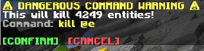

# Command Safety Mod

Have you ever accidentally killed all entities in your world with a single command? Or maybe you've cleared all the scoreboards ?

This mod helps you avoid such mishaps, by requiring the player to **confirm commands** that have the potential to break a lot of things.

Very useful when working on large projects, especially when multiple people (*that potentially have less experience with commands*) are involved.

-----

**The commands & the conditions of when the commands get stopped:**
- `/fill`, `/clone`
    - When selecting an area of more than 10 000 blocks.
- `/execute`, `/kill`, `/effect`, `/tp`, `/teleport`, `/give`, `/clear`, `/gamemode`
    - When affecting more than 50 entities (players, ravagers, item frames).
    - When affecting more than 25 living entities (players, ravagers, ...).
    - When affecting more than 1 player.
- `/scoreboard`
    - When affecting more than 50 score holders (players / entities).
    - When using the `/scoreboard players reset ..` command without selecting an objective.

  
-----